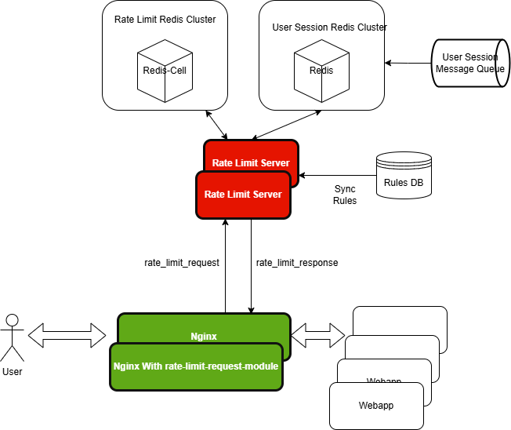

# rate-limit-server

## Architecture Image


## nginx rate limit request module
[Here](https://github.com/ralgond/ngx_http_rate_limit_request_module)

## Database
```bash
CREATE TABLE `rules` (
  `id` int NOT NULL AUTO_INCREMENT,
  `key_type` enum('IP','SI') NOT NULL,
  `method` char(10) NOT NULL,
  `path_pattern` varchar(1024) NOT NULL,
  `deleted` tinyint(1) NOT NULL,
  `create_time` date NOT NULL,
  `update_time` date NOT NULL,
  `burst` int NOT NULL,
  `token_count` int NOT NULL,
  `token_time_unit` int NOT NULL,
  PRIMARY KEY (`id`)
) ENGINE=InnoDB DEFAULT CHARSET=utf8mb4 COLLATE=utf8mb4_0900_ai_ci
```
examples:


| id | key_type | method | path_pattern | deleted | create_time | update_time | burst | token_count | token_time_unit |
|----|----------|--------|--------------|---------|-------------|-------------|-------|-------------|-----------------|
|  1 | IP       | GET    | /.*          |       0 | 2024-11-13  | 2024-11-14  |    15 |          30 |              60 |
|  2 | SI       | POST   | /article/new |       0 | 2024-11-13  | 2024-11-13  |     3 |           3 |              60 |
|  3 | SI       | GET    | /article/\d+ |       0 | 2024-11-14  | 2024-11-14  |     5 |           5 |              60 |

## Flowchart

